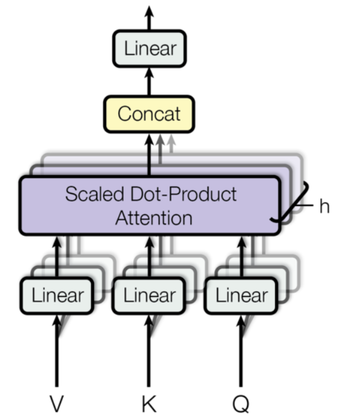
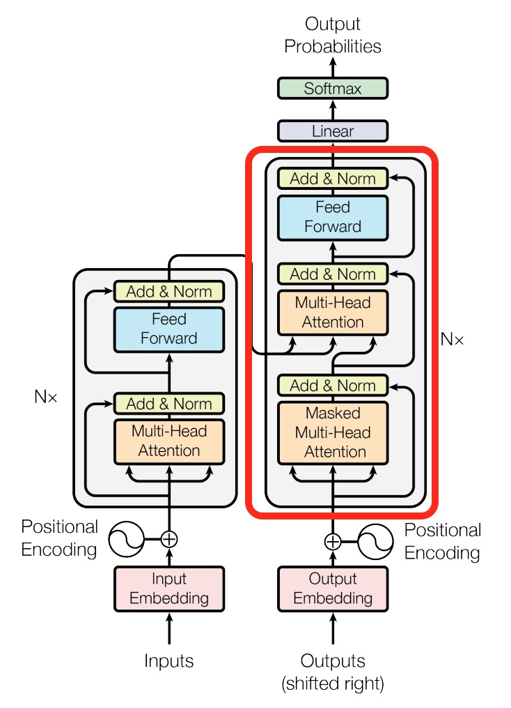
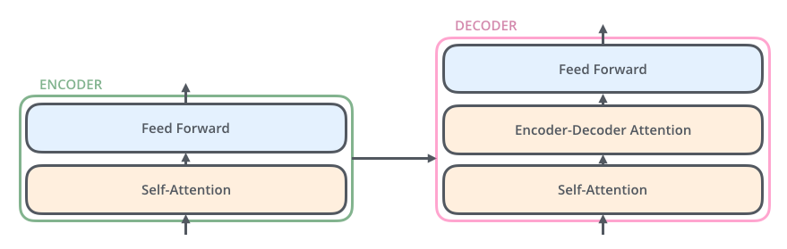

# The attention in transformer （面经总结）

在NLP算法相关的面试里，Transformer显然是重中之重。而Attention机制显然又是其中的高频问题。笔者总结，在Transformer中，attention相关的高频提问主要有如下几个问题。

## 面经问题

### 1. 问：自注意力(self-attention)的计算公式是怎样的？

答：

$$\text{Attention }(Q, K, V)=\operatorname{softmax}\left(\frac{Q K^{T}}{\sqrt{d_{k}}}\right)V  \tag{1}$$

其中$Q,K,V$为$query,key,value$，加 $softmax$ 是因为权重必须为概率分布即和为1

### 2.问：Transformer里自注意力机制的计算过程是怎样的？

答：



> 1. 将输入单词转化成嵌入向量(自注意力计算之前)；
> 2. 根据嵌入向量得到 $q$ ,$k$ ,$v$三个向量；self-attention 中，$q,k,v$由 embedding 的结果经过不同的线性变换得到，维度都是 $h_{hidden} \times l_{src}$
> 3. 为每个向量计算一个score：$score=q\cdot{k}$ ；
> 4. 为了梯度的稳定，Transformer使用了score归一化，即除以 $\sqrt{d_{k}}$ ；
> 5. 对score施以softmax激活函数；
> 6. softmax点乘Value值 $v$ ，得到加权的每个输入向量的评分 $v$  ；
> 7. 相加之后得到最终的输出结果 $z:z=\sum{v}$ 。

### 3.问：Multi-Head Attention是什么，有什么作用？

答：

Multi-Head Attention相当于 $h$ 个不同的self-attention的集成（ensemble），在这里我们以 ![[公式]](https://www.zhihu.com/equation?tex=h%3D8) 举例说明。Multi-Head Attention的输出分成3步

> 1. 将数据 $X$分别输入到图13所示的8个self-attention中，得到8个加权后的特征矩阵 ![[公式]](https://www.zhihu.com/equation?tex=Z_i%2C+i%5Cin%5C%7B1%2C2%2C...%2C8%5C%7D) 。
> 2. 将8个 ![[公式]](https://www.zhihu.com/equation?tex=Z_i) 按列拼成一个大的特征矩阵；
> 3. 特征矩阵经过一层全连接后得到输出 ![[公式]](https://www.zhihu.com/equation?tex=Z) 。

原论文中表明，将模型分为多个头，形成多个子空间，可以让模型去关注不同方面的信息。

### 4.问：Transformer的中的attention机制，其中self-attention和encoder-decoder attention之间的关系？

答：





Encoder-Decoder Attention如图所示，在解码器中，Decoder block比Encoder中多了个encoder-decoder attention。在encoder-decoder attention中， $Q$来自于解码器的上一个输出， $K$ 和 $V$则来自于与编码器的输出。其计算方式完全和encoder的过程相同。

因为在机器翻译中，解码过程是一个顺序操作的过程，也就是当解码第 ![[公式]](https://www.zhihu.com/equation?tex=k) 个特征向量时，我们只能看到第 ![[公式]](https://www.zhihu.com/equation?tex=k-1) 及其之前的解码结果，也把这种情况下的multi-head attention叫做masked multi-head attention。

### 5.问：都有哪些不同类型的注意力，其公式及计算过程和复杂度差异有什么区别。

这个问题也会被分为几个子问题

> 1. 加性注意力(Additive Attention、乘性注意力(Dot Product Attention),缩放点积注意力(Scaled Dot-Product Attention)的公式与计算过程？
> 2. Transformer计算attention的时候为何选择点乘而不是加法？
> 3. 两者计算复杂度和效果上有什么区别？
> 4. 为什么在进行$softmax$之前需要对attention进行scaled (attention计算时为什么要除$\sqrt{d_k}$ ) ？

答：这几个问题在理解上紧密相连，所以我们放在一起进行讨论。

首先我们来看一下三者的公式，

**Additive Attention**(加性注意力模型)


$$
s(x_i,q)=v^{T}tanh(W{x_i}+Uq) \tag{2} 
$$

**dot product attention** （乘性注意力/点积模型）

$$
S(x_i,q)=x^{T}_{i}q \tag{3}
$$

**Scaled Dot-Product Attention**(缩放点积模型)：

$$
S(x_i,q)=x^{T}_{i}q/\sqrt{d_k} \tag{4}
$$

当然常见的还有 很多其他模型，如双线性模型 $ S(x_i,q)=x^{T}_{i}Wq $ 等：这里主要讨论上述三种

**计算过程详解：**

想象成一句中文与其对应的英文翻译，每个词为一个向量,两个序列也可以不等长，我们要计算两组序列彼此之间的attention权重。其过程大体可以被抽象为三步：

> ① 信息输入：将 语言输入模型，转换为对应的向量，$q,k,v$ 或者 $key,value$
> 我们这里假设存在两组向量序列来表示一句话与其对应的翻译。
>
> $\textbf{H}:h_1,h_2,...h_n$和$\textbf{S}:s_1,s_2,... ,s_n$，任意一个元素的维度为$d_k$
>
> ② 对于任意的$h_i,s_j$,以某种attention函数计算两者之间的分数
>
> ③ 信息加权平均

这个过程对于Additive Attention而言，即为

> 1.计算任意向量$h_i$与向量$s_1,s_2,... ,s_n$的attention权重
>
> 2.然后拼接$h_i-s_1$通过一个特定的线性层计算出其分数，再拼接$h_i-k_2$重复通过线性层计算，...，直到所有的均计算出一个结果
>
> 3.再把所有结果通过$softmax$。

其计算过程公式如下

$$
\begin{eqnarray}
\mathbf{c}_{t}&=&\sum_{i=1}^{n} \alpha_{t, i} \boldsymbol{h}_{i} \quad ; 输出的上下文向量 y_{t}\\
\alpha_{t, i}&=&\operatorname{align}\left(y_{t}, x_{i}\right) \quad; 两个单词y_{t}和x_{i}的对齐情况\\
&=&\frac{\exp \left(\operatorname{score}\left(s_{t-1}, \boldsymbol{h}_{i}\right)\right)}{\sum_{i^{\prime}=1}^{n} \exp \left(\operatorname{score}\left(\boldsymbol{s}_{t-1}, \boldsymbol{h}_{i^{\prime}}\right)\right)} \quad ; 对自定义的对齐分数进行 softmax
\end{eqnarray} \tag{5}
$$

从这个角度讲，Additive Attention注意力的公式也可以看作

$$
f_{score(i,j)} = v_{a}^{T}\tanh\left(\textbf{W}_{a}\left[\textbf{h}_{i};\textbf{s}_{j}\right]\right)=\left.v^{T} \tanh \left(W_{1} s_{i}+W_{2} h_{j}\right]\right) \tag{6}
$$
其中$v_a$和$\textbf{W}_{a}$是学习的注意参数。这里$\textbf{h}$是指编码器的隐藏状态，$\textbf{s}$是解码器的隐藏状态。

**Dot Product Attention** and **Scaled Dot-Product Attention**

同样地，我们也可以将$f_{score(i,j)}$函数替换为乘性注意力，即
$$
f_{score(i,j)}=F\left(s_{i}, h_{j}\right)=s_{i}^{T} h_{j} \tag{7}
$$
而上述的计算过程不变，依次对任意的$s_i,h_j$求出其乘性注意力分数,然后统一再$softmax$。细心的同学也应该已经发现了，这个过程对于序列$\textbf{H}$和$\textbf{S}$而言,就是矩阵相乘的过程。

Dot Product Attention 和 Additive Attention两者在复杂度上是相似的，但是Dot Product Attention在实践中往往要更快速、具有更高效的存储，因为它可以使用矩阵操作更高效地实现。Additive Attention增加了三个可学习的矩阵，所以相比另外两个效果会更好，但是同时增加了更多的模型参数，计算效率会较低。而Self Attention则如上文所讲，对于一句话引入了$q,k,v$三个矩阵，也保证了计算速度,所以综合来看是最好的。其计算过程如上述内容。

同时我们也可以看到，对于任意两个维度为$d_k$的元素$s_i,h_j$相乘，在$d_k$较小时二者表现相似，但是$d_k$较大时，Dot Product Attention表现不如Additive Attention，因为$d_k$较大时点积之后的结果较大，方差也会变大，求softmax之后，梯度会很小,容易梯度消失，不利于计算，需要做一定的缩放。所以才会有了进一步的Scaled Dot-Product Attention 
$$
S(x_i,q)=x^{T}_{i}q/\sqrt{d_k} \tag{8}
$$
除以$\sqrt{d_k}$的具体证明则如下(参考自paper原文)，

假设输入元素$x_i$转化而来的$q,k$每一维是均值为0、方差为1的独立随机变量，一共有$d_k$维，那么它们的点积$q·k=\sum_{i=1}^{d_k}q_ik_i$的均值为0、方差为$d_k$

因为，如果两个变量$X$和$Y$是独立随机变量，则其乘积的方差与期望为

$$
\operatorname{var}\left(\sum x_{i} y_{i}\right)=k \operatorname{var}\left(x_{1} y_{1}\right)=k E\left[x_{1}^{2}\right] E\left[y_{1}^{2}\right]=k \sigma^{4} \tag{9}
$$
$$
E\left[\sum x_{i} y_{i}\right]=k E\left[x_{1} y_{1}\right]=0 \tag{10}
$$

所以换算到上式中即方差为$d_k$,我们要控制方差为1，所以就要除以$\sqrt{d_k}$，即下式

$$
D\left(\frac{q \cdot k}{\sqrt{d}_{k}}\right)=\frac{d_{k}}{\left(\sqrt{d}_{k}\right)^{2}}=1 \tag{11}
$$

将方差控制为1，也就有效地控制了前面提到的梯度消失的问题。

### 6.问：self-attention代码实现？

答：

```

import torch.nn as nn

def clones(module, N):
    """
    Produce N identical layers.
    """
    return nn.ModuleList([copy.deepcopy(module) for _ in range(N)])


def attention(query, key, value, mask=None, dropout=None):
    """
    Compute 'Scaled Dot Product Attention'
    """
    d_k = query.size(-1)
    scores = torch.matmul(query, key.transpose(-2, -1)) / math.sqrt(d_k)
    if mask is not None:
        scores = scores.masked_fill(mask == 0, -1e9)
    p_attn = F.softmax(scores, dim=-1)
    if dropout is not None:
        p_attn = dropout(p_attn)
    return torch.matmul(p_attn, value), p_attn


class MultiHeadedAttention(nn.Module):
    """
    Implements 'Multi-Head Attention' proposed in the paper.
    """

    def __init__(self, h, d_model, dropout=0.1):
        """
        Take in model size and number of heads.
        """
        super(MultiHeadedAttention, self).__init__()
        assert d_model % h == 0
        # We assume d_v always equals d_k
        self.d_k = d_model // h
        self.h = h
        self.linears = clones(nn.Linear(d_model, d_model), 4)
        self.attn = None
        self.dropout = nn.Dropout(p=dropout)

    def forward(self, query, key, value, mask=None):
        if mask is not None:
            # Same mask applied to all h heads.
            mask = mask.unsqueeze(1)
        nbatches = query.size(0)

        # 1) Do all the linear projections in batch from d_model => h x d_k
        query, key, value = [l(x).view(nbatches, -1, self.h, self.d_k).transpose(1, 2)
                             for l, x in zip(self.linears, (query, key, value))]

        # 2) Apply attention on all the projected vectors in batch.
        x, self.attn = attention(query, key, value, mask=mask, dropout=self.dropout)

        # 3) "Concat" using a view and apply a final linear.
        x = x.transpose(1, 2).contiguous().view(nbatches, -1, self.h * self.d_k)
        return self.linears[-1](x)
```


## 参考

1. 详解Transformer （Attention Is All You Need） - 大师兄的文章 - 知乎 https://zhuanlan.zhihu.com/p/48508221
2. 拆 Transformer 系列二：Multi- Head Attention 机制详解 - 随时学丫的文章 - 知乎 https://zhuanlan.zhihu.com/p/109983672
3. Attention的一些笔记 - 你小妹儿儿儿的文章 - 知乎 https://zhuanlan.zhihu.com/p/137464173
4. transformer中的attention为什么scaled? - TniL的回答 - 知乎 https://www.zhihu.com/question/339723385/answer/782509914
5. Neural Machine Translation by Jointly Learning to Align and Translate
6. http://jalammar.github.io/illustrated-transformer/
7. https://lilianweng.github.io/lil-log/2018/06/24/attention-attention.html
8. http://nlp.seas.harvard.edu/2018/04/03/attention.html
